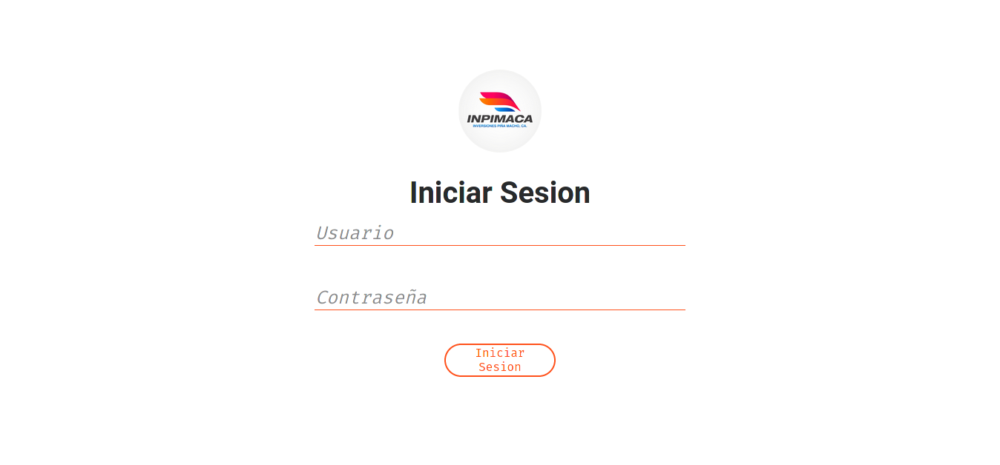
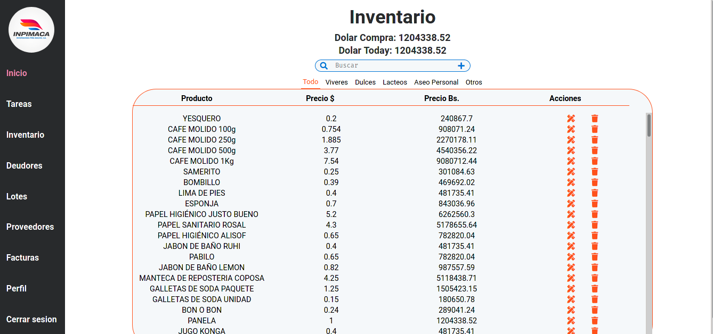
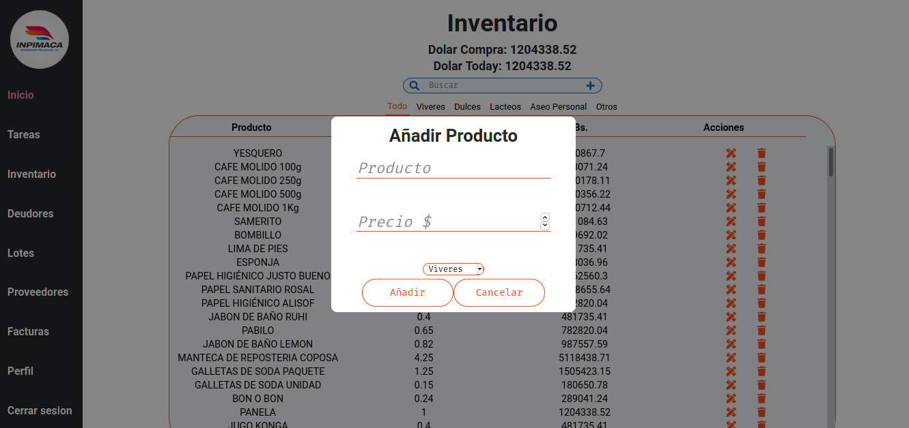

# INPIMACA App

This is an administrative app used for manage the prices, dolar price, add, delete and modify items from the inventory.

I'll build new functions in the future.

Is builted with react, use redux, to manage the states, and was bootstraped using create-react-app.

## Screenshots

